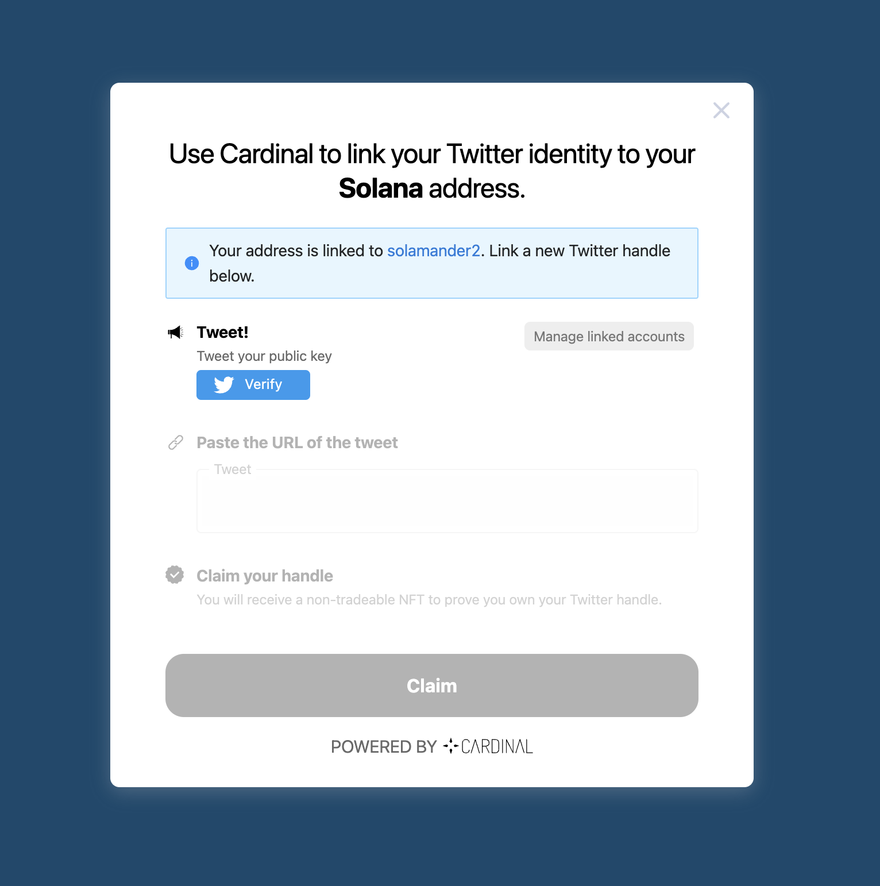
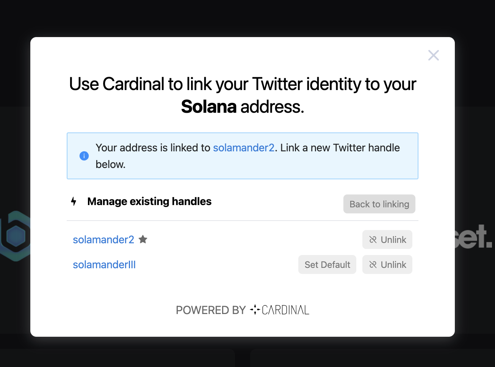

# Cardinal Identity UI

This repository houses the UI and associated components for integrating identity tokens into dApps. It also maintains a deployment for our on-chain Twitter linking flow https://twitter.cardinal.so.

Use this repo to link identity tokens to your wallet, or drop the UI components into your app to implement global identity and enhance its UX.

For questions or technical help, join our **[Discord](https://discord.gg/stX2FAYbVq)**.

| Package                           | Description                              | Version                                                                                                                                   | Docs                                                                                                             |
| :-------------------------------- | :--------------------------------------- | :---------------------------------------------------------------------------------------------------------------------------------------- | :--------------------------------------------------------------------------------------------------------------- |
| `@cardinal/namespaces-components` | TypeScript SDK for namespaces-components | [](https://www.npmjs.com/package/@cardinal/namespaces-components) | [](https://cardinal-labs.github.io/cardinal-identity-ui/) |

## Quick Links

- [Docs](https://cardinal-labs.github.io/cardinal-identity-ui/)
- [Example](https://twitter.cardinal.so)
- [Quick Setup (using React UI)](#quick-setup-using-react-ui)
  - [Install](#install)
  - [Setup](#setup)
  - [Usage (UI Components)](#usage-of-ui-components)
  - [Usage (Data Hooks)](#usage-of-hooks)

---

<div align="center">
  
  
</div>

## Example UI

The main UI can be accessed at https://twitter.cardinal.so. Use this UI as a simple interface to link and unlink twitter profiles. Each profile is represented as an NFT generated by https://github.com/cardinal-labs/cardinal-generators.

For infomration on how to use the UI components, please see the Getting Started section.

## Getting Started

Start by taking a look at the UI components documentation here https://cardinal-labs.github.io/cardinal-identity-ui/

<div align="center">
  
</div>

This documentation offers a high level overview of how to incorporate cardinal-identity-ui into your dApp.

The UI has the following components

- Fully featured account connector that includes wallet and setting identity
- Modal for linking new identities and managing existing ones
- Drop in components for replacing wallet addresses with names, images, and small profiles
- Hooks to directly look up the mapping from wallet to name (and vice versa) and to use this data in your app. All hooks come with loading state for smooth build-ins

### Install

```shell
yarn add @cardinal/namespaces \
         @solana/web3.js \
         react
```

### Setup

```tsx
import '@cardinal/namespaces-components/dist/esm/styles.css'
import { WalletProvider } from '@solana/wallet-adapter-react'
import { getWalletAdapters } from '@solana/wallet-adapter-wallets'
import { WalletModalProvider } from '@solana/wallet-adapter-react-ui'
import { WalletIdentityProvider } from '@cardinal/namespaces-components'

require('@solana/wallet-adapter-react-ui/styles.css')

const App = () => (
  <WalletProvider autoConnect wallets={getWalletAdapters()}>
    <WalletIdentityProvider>
      <WalletModalProvider>
        {/* Your app's components go here, nested within the context providers. */}
      </WalletModalProvider>
    </WalletIdentityProvider>
  </WalletProvider>
)

export default App
```

### Usage of UI Components

```tsx
import React from 'react'
import { useConnection, useWallet } from '@solana/wallet-adapter-react'
import {
  AddressImage,
  DisplayAddress,
  ProfileSmall,
} from '@cardinal/namespaces-components'
import { Wallet } from '@saberhq/solana-contrib'

export const User: FC = () => {
  const { connection } = useConnection()
  const wallet = useWallet()
  return (
    <div>
      {/* Account linking and wallet connector */}
      <AccountConnect
        dark={true}
        connection={connection}
        handleDisconnect={() => wallet.disconnect()}
        wallet={wallet as Wallet}
      />
      {/* Replace address with image */}
      <AddressImage address={wallet.publicKey} connection={connection} />
      {/* Replace address with name */}
      <DisplayAddress address={wallet.publicKey} connection={connection} />
      {/* Profile from address */}
      <ProfileSmall address={wallet.publicKey} connection={connection} />
      {/* Button to connect twitter profile */}
      <ConnectButton connection={connection} wallet={wallet} />
    </div>
  )
}
```

### Usage of Hooks

```tsx
import React from 'react'
import { useConnection, useWallet } from '@solana/wallet-adapter-react'
import {
  AddressImage,
  DisplayAddress,
  ProfileSmall,
} from '@cardinal/namespaces-components'
import { Wallet } from '@saberhq/solana-contrib'

export const User: FC = () => {
  const { connection } = useConnection()
  const wallet = useWallet()
  const { displayName, loadingName, refreshName } = useAddressName(
    connection,
    wallet.publicKey
  )
  const { addressImage, loadingImage } = useAddressImage(
    connection,
    wallet.publicKey
  )
  return (
    <div>
      <div>{displayName}</div>
      
    </div>
  )
}
```

## Development

To get started, clone the repo and run:

```bash
yarn install
```

Next, run the development server:

```bash
yarn run dev
```

Open [http://localhost:3000](http://localhost:3000) with your browser to see the staking interface running locally.

## Set your Cluster

To access different clusters in the scaffold, set the `cluster` query parameter in the URL:

- Mainnet - http://localhost:3000?cluster=mainnet
- Devnet - http://localhost:3000?cluster=devnet
- Testnet - http://localhost:3000?cluster=testnet

The default cluster set is **mainnet**. It's recommended to ensure you have `?cluster=devnet` while testing out functionality.

## Have questions?

Join our **[Discord](https://discord.gg/stX2FAYbVq)** to get technical support as you build on Cardinal.

---
